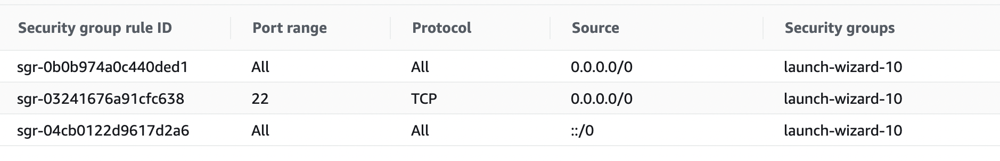

#Steps to set up an EC2 Ubuntu instance  
The sever that we created is a t2.micro instance  
Server: Ubuntu Server 20.04 LTS (HVM)  

#Add security configs:  

#Installations to set up envs:  
sudo apt-get update  
sudo apt-get install python3  
sudo apt-get install python3-pip  
sudo pip install flask  
sudo apt-get install nginx  
sudo apt install gunicorn  

#Make a folder  
mkdir flask-app   
sudo nano app.py  

#After creating the flask app set up Gunicorn and nginx  
cd /etc/nginx  
cd sites-enabled  
sudo vi flaskapp  
<Copy configs and edit from https://gunicorn.org/#deployment>  
sudo service nginx restart  
cd ~   

#To run the app  
python3 app.py (or) gunicorn app:app  

